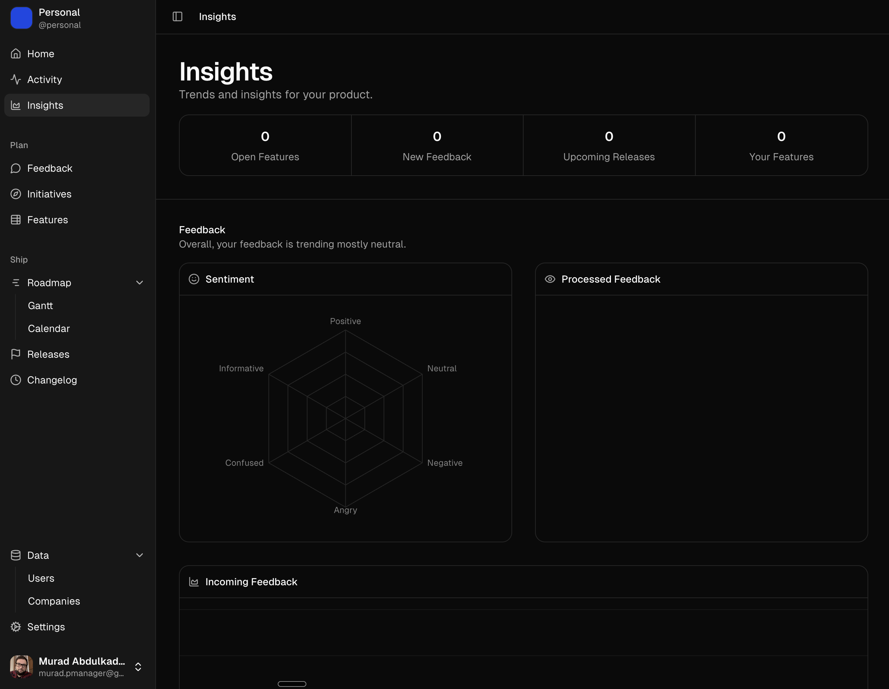

<a href="https://portal.vercel.app">
  
  <h1 align="center">Portal</h1>
</a>

<p align="center">
  Open Source Product Management Platform Built with Next.js, Supabase and AI SDK.
</p>

<p align="center">
  <a href="#features"><strong>Features</strong></a> ·
  <a href="#model-provider"><strong>Model provider</strong></a> 
  <a href="#deploy-your-own"><strong>Deploy your own</strong></a> ·
  <a href="#running-locally"><strong>Running locally</strong></a>
</p>
<br/>

## Features

- [Next.js](https://nextjs.org) App Router with multiple apps for `app`, `api`, `web`, and `portal`
- [Turborepo](https://turbo.build/repo) monorepo powered by [`next-forge`](https://www.next-forge.com)
- [Drizzle](https://orm.drizzle.team/) + [Better Auth](https://www.better-auth.com/) backend package
- Rich text editor with Novel and TipTap plus an Excalidraw canvas package
- Design system built on [shadcn/ui](https://ui.shadcn.com), [Tailwind CSS](https://tailwindcss.com), and [Radix UI](https://radix-ui.com)

## Model Providers

This app uses [Openai](https://openai.com/) as the default provider via the [AI SDK](https://sdk.vercel.ai/docs). You can switch LLM providers to [Ollama](https://ollama.com), [Anthropic](https://anthropic.com), [Cohere](https://cohere.com/), and [many more](https://sdk.vercel.ai/providers/ai-sdk-providers) with just a few lines of code.

## Deploy your own

Portal is designed to be deployed on Vercel. Create 4 projects (`app`, `api`, `web`, `portal`) and set the Root Directory to the app you are deploying (for example `apps/app`). Then add the required environment variables and deploy.

## Running locally

You will need to use the environment variables [defined in `.env.example`](.env.example) to run Fragmenta. It's recommended you use [Vercel Environment Variables](https://vercel.com/docs/projects/environment-variables) for this, but a `.env` file is all that is necessary.

> Note: You should not commit your `.env` file or it will expose secrets that will allow others to control access to your various Convex and authentication provider accounts.

1. Install Vercel CLI: `npm i -g vercel`
2. Link local instance with Vercel and GitHub accounts (creates `.vercel` directory): `vercel link`
3. Download your environment variables: `vercel env pull`

```bash
npm install
npm run dev
```

Your app should now be running on [localhost:3000](http://localhost:3000/).